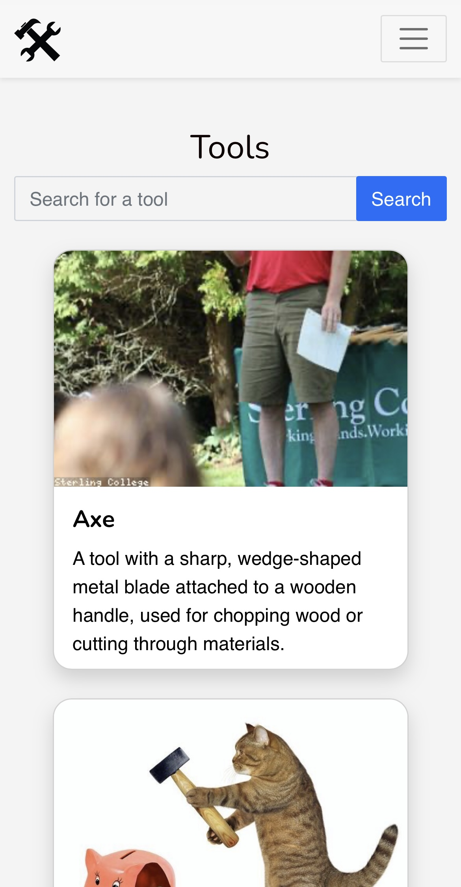

<h1 align="center">ToolConect</h1>

ToolConect is a responsive project built for people to rent equipment and tools in Berlin at an affordable price for home use. It was developed as part of my introduction to Ruby on Rails during my web development bootcamp, showcasing my knowledge in the language. We had one week to create this project.

<a href="#-tecnologies">Tecnologies</a>
<a href="#-instalation-instructions">Instalation Instructions</a>
<a href="#-team-members">Team Members</a>

## Tecnologies
This project was built with:

- Ruby on Rails
- JavaScript (Stimulus)
- Bootstrap (styling)

## Installation Instructions
To make a booking or access your equipment and bookings, you need to create an account and log in.

- <a href= "https://toolconnect.herokuapp.com">Acess the finished project online</a>

## Team Members
- Kauana Tombolato
- Patrick Bird
- Andreas Aichinger
- Yaya